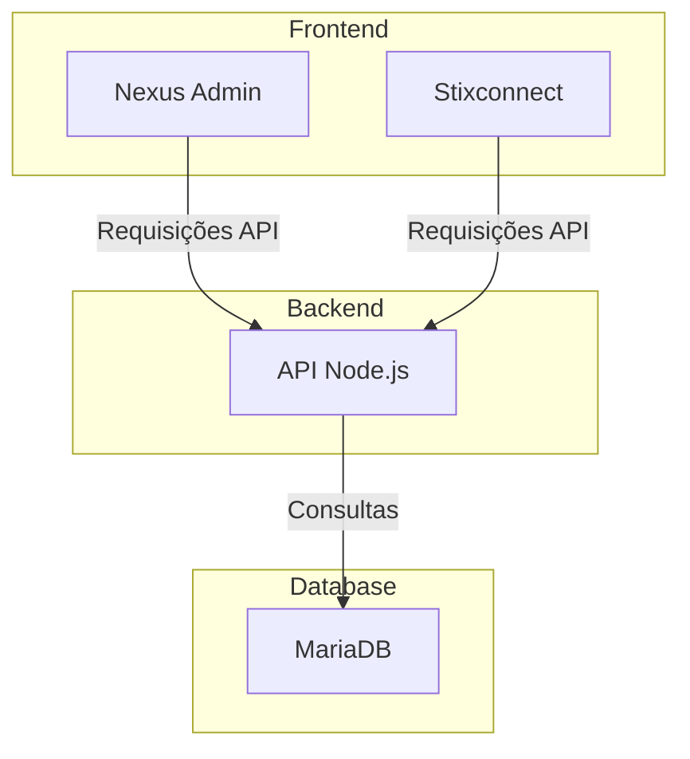
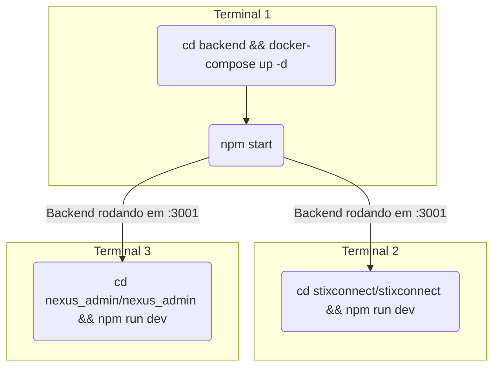

# Stixconnect - Guia de Instalação e Execução

Este guia fornece instruções passo a passo para configurar e executar o ambiente de desenvolvimento completo da aplicação Stixconnect, incluindo o banco de dados, o backend e o frontend.

## Arquitetura do Projeto

Abaixo está um diagrama que ilustra a arquitetura geral da aplicação.



## Pré-requisitos

Antes de começar, certifique-se de que você tem os seguintes softwares instalados em sua máquina:

- [Node.js](https://nodejs.org/) (versão 18 ou superior)
- [Docker](https://www.docker.com/products/docker-desktop/)
- [Git](https://git-scm.com/)

## 1. Configuração do Banco de Dados

O banco de dados MariaDB é executado em um contêiner Docker. Para iniciá-lo, siga os passos abaixo:

1.  **Navegue até o diretório do backend:**
    ```bash
    cd backend
    ```

2.  **Inicie os serviços do Docker Compose:**
    Este comando irá construir e iniciar o contêiner do banco de dados em segundo plano.
    ```bash
    docker-compose up -d
    ```

    ```mermaid
    sequenceDiagram
        participant User
        participant Docker
        participant MariaDB Container

        User->>Docker: Executa `docker-compose up -d`
        Docker->>MariaDB Container: Inicia o contêiner
        MariaDB Container-->>Docker: Serviço pronto
        Docker-->>User: Contêiner em execução
    ```

## 2. Configuração do Backend

O backend é uma aplicação Node.js.

1.  **Acesse o diretório `backend`:**
    ```bash
    cd backend
    ```

2.  **Copie o arquivo de ambiente:**
    ```bash
    cp .env.example .env
    ```
    *Observação: Edite o arquivo `.env` se precisar alterar as credenciais do banco de dados ou outras configurações.*

3.  **Instale as dependências:**
    ```bash
    npm install
    ```

4.  **Inicie o servidor:**
    ```bash
    npm start
    ```
    O servidor backend estará em execução em `http://localhost:3001`.

## 3. Configuração do Frontend

O projeto possui duas aplicações frontend: `nexus_admin` e `stixconnect`. As instruções abaixo são para a aplicação principal `stixconnect`.

### Stixconnect (Aplicação Principal)

1.  **Acesse o diretório da aplicação:**
    ```bash
    cd stixconnect/stixconnect
    ```

2.  **Instale as dependências:**
    ```bash
    npm install
    ```

3.  **Inicie a aplicação de desenvolvimento:**
    ```bash
    npm run dev
    ```
    A aplicação estará acessível em `http://localhost:3000`.

### Nexus Admin (Aplicação de Administração)

1.  **Acesse o diretório da aplicação:**
    ```bash
    cd nexus_admin/nexus_admin
    ```

2.  **Instale as dependências:**
    ```bash
    npm install
    ```

3.  **Inicie a aplicação de desenvolvimento:**
    ```bash"
    npm run dev
    ```
    A aplicação de administração estará acessível em um endereço diferente, geralmente `http://localhost:3002` (verifique o output do terminal).

## Resumo do Fluxo de Execução


