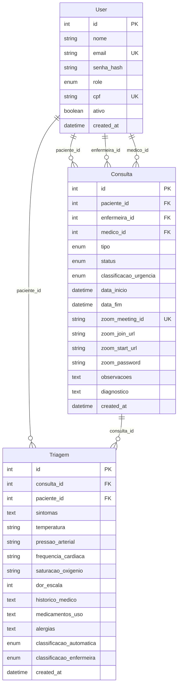

# Como Funciona o Backend - StixConnect

## Sumário

Este documento explica detalhadamente a arquitetura, implementação e funcionamento do backend do StixConnect, um sistema de teleconsulta médica com integração Zoom.

- [Visão Geral da Arquitetura](#visão-geral-da-arquitetura)
- [Fluxo de Autenticação](#fluxo-de-autenticação)
- [Workflow de Consultas Médicas](#workflow-de-consultas-médicas)
- [Banco de Dados](#banco-de-dados)
- [API Endpoints](#api-endpoints)
- [Integração com Zoom](#integração-com-zoom)
- [Guia de Desenvolvimento](#guia-de-desenvolvimento)
- [Boas Práticas](#boas-práticas)

---

## Visão Geral da Arquitetura

### Estrutura FastAPI

```
stixconnect-backend/
├── app/
│   ├── main.py              # Entry point da aplicação
│   ├── core/                # Configurações centrais
│   │   ├── config.py        # Configurações e variáveis de ambiente
│   │   ├── database.py      # Configuração do banco de dados
│   │   └── security.py      # JWT e segurança
│   ├── models/              # Models SQLAlchemy
│   │   └── models.py        # Entidades do banco de dados
│   ├── schemas/             # Schemas Pydantic
│   │   └── schemas.py       # Validação de request/response
│   ├── routers/             # Routes FastAPI
│   │   ├── auth.py          # Endpoints de autenticação
│   │   ├── consultas.py     # Gestão de consultas
│   │   └── admin.py         # Endpoints administrativos
│   └── services/            # Lógica de negócio
│       ├── triagem_service.py
│       └── zoom_service.py
├── docs/
├── requirements.txt
└── .env.example
```

### Camadas da Arquitetura

1. **Presentation Layer** (Routers FastAPI)
   - Define endpoints HTTP
   - Validação com Pydantic
   - Middleware CORS

2. **Business Logic Layer** (Services)
   - `triagem_service.py`: Lógica de classificação de urgência
   - `zoom_service.py`: Integração com API Zoom
   - Separação clara de responsabilidades

3. **Data Access Layer** (Models + Database)
   - SQLAlchemy ORM
   - Relacionamentos bem definidos
   - Migrations automáticas

4. **Core Layer** (Config, Security)
   - Configurações centralizadas
   - JWT authentication
   - Database connection

---

## Fluxo de Autenticação

### JWT Implementation

O sistema utiliza tokens JWT para autenticação stateless:

```python
# app/core/security.py
from jose import JWTError, jwt
from passlib.context import CryptContext
from datetime import datetime, timedelta

pwd_context = CryptContext(schemes=["bcrypt"], deprecated="auto")

def create_access_token(data: dict, expires_delta: timedelta = None):
    to_encode = data.copy()
    if expires_delta:
        expire = datetime.utcnow() + expires_delta
    else:
        expire = datetime.utcnow() + timedelta(minutes=15)
    to_encode.update({"exp": expire})
    encoded_jwt = jwt.encode(to_encode, SECRET_KEY, algorithm=ALGORITHM)
    return encoded_jwt
```

### Role-Based Access Control (RBAC)

Quatro papéis definidos no sistema:

```python
class UserRole(str, enum.Enum):
    PATIENT = "patient"    # Pacientes
    NURSE = "nurse"        # Enfermeiras
    DOCTOR = "doctor"      # Médicos
    ADMIN = "admin"        # Administradores
```

### Fluxo de Login

1. **Request**: `POST /auth/login` com email e senha
2. **Validation**: Verificar credenciais no banco
3. **Token Generation**: Criar JWT com user_id e role
4. **Response**: Retornar token e informações do usuário

### Middleware de Segurança

```python
# app/core/security.py
from fastapi import Depends, HTTPException, status
from fastapi.security import HTTPBearer, HTTPAuthorizationCredentials

security = HTTPBearer()

async def get_current_user(credentials: HTTPAuthorizationCredentials = Depends(security)):
    credentials_exception = HTTPException(
        status_code=status.HTTP_401_UNAUTHORIZED,
        detail="Could not validate credentials",
        headers={"WWW-Authenticate": "Bearer"},
    )
    try:
        payload = jwt.decode(credentials.credentials, SECRET_KEY, algorithms=[ALGORITHM])
        user_id: str = payload.get("sub")
        if user_id is None:
            raise credentials_exception
    except JWTError:
        raise credentials_exception
    
    user = get_user(user_id)
    if user is None:
        raise credentials_exception
    return user
```

---

## Workflow de Consultas Médicas

### Estados da Consulta

```python
class ConsultaStatus(str, enum.Enum):
    AGUARDANDO = "aguardando"          # Paciente solicitou
    EM_TRIAGEM = "em_triagem"          # Enfermeira realizando triagem
    AGUARDANDO_MEDICO = "aguardando_medico"  # Aguardando médico disponível
    EM_ATENDIMENTO = "em_atendimento"   # Consulta em andamento
    FINALIZADA = "finalizada"          # Consulta concluída
    CANCELADA = "cancelada"            # Consulta cancelada
```

### Fluxo Completo

#### 1. Início - Solicitação do Paciente
```python
# POST /consultas/
{
    "tipo": "urgente",  # ou "agendada"
    "data_agendamento": "2024-01-20T14:00:00",  # opcional para urgente
    "observacoes": "Dor intensa no peito"
}
```

**Estado**: `AGUARDANDO`

#### 2. Triagem pela Enfermeira
```python
# POST /consultas/{id}/iniciar-triagem
{
    "sintomas": "Dor no peito, falta de ar",
    "temperatura": "37.5",
    "pressao_arterial": "140/90",
    "frequencia_cardiaca": "95",
    "saturacao_oxigenio": "96",
    "dor_escala": 8,
    "classificacao_enfermeira": "alta"
}
```

**Estado**: `EM_TRIAGEM` → `AGUARDANDO_MEDICO`

#### 3. Atribuição e Consulta Médica
```python
# POST /consultas/{id}/atribuir-medico/{medico_id}
# POST /consultas/{id}/iniciar-atendimento
```

**Estado**: `AGUARDANDO_MEDICO` → `EM_ATENDIMENTO`

#### 4. Finalização
```python
# POST /consultas/{id}/finalizar
{
    "diagnostico": "Dor torácica atípica",
    "prescricao": "Repouso, retornar se piorar",
    "orientacoes": "Evitar esforços físicos intensos"
}
```

**Estado**: `EM_ATENDIMENTO` → `FINALIZADA`

### Classificação de Urgência

Algoritmo automático baseado nos dados de triagem:

```python
# app/services/triagem_service.py
def classificar_urgencia(triagem_data):
    score = 0
    
    # Temperatura
    if float(triagem_data.temperatura) > 38.5:
        score += 2
    
    # Pressão arterial
    pressao = triagem_data.pressao_arterial.split('/')
    sistolica = int(pressao[0])
    if sistolica > 160 or sistolica < 90:
        score += 2
    
    # Saturação
    if triagem_data.saturacao_oxigenio and float(triagem_data.saturacao_oxigenio) < 95:
        score += 3
    
    # Escala de dor
    if triagem_data.dor_escala >= 8:
        score += 3
    elif triagem_data.dor_escala >= 5:
        score += 2
    
    # Classificação final
    if score >= 6:
        return "critica"
    elif score >= 4:
        return "alta"
    elif score >= 2:
        return "media"
    else:
        return "baixa"
```

---

## Banco de Dados

### Entidades Principais

#### User (Usuários)
```python
class User(Base):
    __tablename__ = "users"
    
    id = Column(Integer, primary_key=True, index=True)
    nome = Column(String(255), nullable=False)
    email = Column(String(255), unique=True, index=True, nullable=False)
    senha_hash = Column(String(255), nullable=False)
    role = Column(Enum(UserRole), nullable=False)
    telefone = Column(String(20))
    cpf = Column(String(14), unique=True, index=True)
    data_nascimento = Column(DateTime)
    ativo = Column(Boolean, default=True)
```

#### Consulta
```python
class Consulta(Base):
    __tablename__ = "consultas"
    
    id = Column(Integer, primary_key=True, index=True)
    paciente_id = Column(Integer, ForeignKey("users.id"), nullable=False)
    enfermeira_id = Column(Integer, ForeignKey("users.id"), nullable=True)
    medico_id = Column(Integer, ForeignKey("users.id"), nullable=True)
    
    tipo = Column(Enum(ConsultaTipo), nullable=False)
    status = Column(Enum(ConsultaStatus), default=ConsultaStatus.AGUARDANDO)
    classificacao_urgencia = Column(Enum(ClassificacaoUrgencia))
    
    # Campos de tempo
    data_agendamento = Column(DateTime, nullable=True)
    data_inicio = Column(DateTime, nullable=True)
    data_fim = Column(DateTime, nullable=True)
    duracao_minutos = Column(Integer, nullable=True)
    
    # Integração Zoom
    zoom_meeting_id = Column(String(255), unique=True)
    zoom_join_url = Column(String(512))
    zoom_start_url = Column(String(512))
    zoom_password = Column(String(50))
```

#### Triagem
```python
class Triagem(Base):
    __tablename__ = "triagens"
    
    id = Column(Integer, primary_key=True, index=True)
    consulta_id = Column(Integer, ForeignKey("consultas.id"), nullable=False)
    paciente_id = Column(Integer, ForeignKey("users.id"), nullable=False)
    
    # Sinais vitais
    sintomas = Column(Text, nullable=False)
    temperatura = Column(String(10))
    pressao_arterial = Column(String(20))
    frequencia_cardiaca = Column(String(10))
    saturacao_oxigenio = Column(String(10))
    dor_escala = Column(Integer)
    
    # Histórico
    historico_medico = Column(Text)
    medicamentos_uso = Column(Text)
    alergias = Column(Text)
    
    # Classificação
    classificacao_automatica = Column(Enum(ClassificacaoUrgencia))
    classificacao_enfermeira = Column(Enum(ClassificacaoUrgencia))
```

### Relacionamentos



---

## API Endpoints

### Autenticação

#### Register User
```http
POST /auth/register
Content-Type: application/json

{
    "nome": "João Silva",
    "email": "joao@exemplo.com",
    "senha": "senha123",
    "role": "patient",
    "telefone": "11999999999",
    "cpf": "123.456.789-00",
    "data_nascimento": "1980-01-01T00:00:00"
}
```

**Response**:
```json
{
    "id": 1,
    "nome": "João Silva",
    "email": "joao@exemplo.com",
    "role": "patient",
    "ativo": true
}
```

#### Login
```http
POST /auth/login
Content-Type: application/json

{
    "email": "joao@exemplo.com",
    "senha": "senha123"
}
```

**Response**:
```json
{
    "access_token": "eyJ0eXAiOiJKV1QiLCJhbGciOiJIUzI1NiJ9...",
    "token_type": "bearer",
    "user": {
        "id": 1,
        "nome": "João Silva",
        "email": "joao@exemplo.com",
        "role": "patient"
    }
}
```

### Consultas

#### Criar Consulta
```http
POST /consultas/
Authorization: Bearer <token>
Content-Type: application/json

{
    "tipo": "urgente",
    "observacoes": "Dor intensa no peito há 2 horas"
}
```

**Response**:
```json
{
    "id": 123,
    "paciente_id": 1,
    "tipo": "urgente",
    "status": "aguardando",
    "observacoes": "Dor intensa no peito há 2 horas",
    "created_at": "2024-01-15T10:30:00"
}
```

#### Listar Consultas
```http
GET /consultas/?status=aguardando_medico&limit=10
Authorization: Bearer <token>
```

#### Iniciar Triagem
```http
POST /consultas/123/iniciar-triagem
Authorization: Bearer <token>
Content-Type: application/json

{
    "sintomas": "Dor no peito, falta de ar",
    "temperatura": "37.5",
    "pressao_arterial": "140/90",
    "frequencia_cardiaca": "95",
    "saturacao_oxigenio": "96",
    "dor_escala": 8,
    "historico_medico": "Hipertensão controlada",
    "medicamentos_uso": "Losartana 50mg",
    "alergias": "Penicilina",
    "classificacao_enfermeira": "alta"
}
```

### Administração

#### Estatísticas
```http
GET /admin/estatisticas?periodo=7d
Authorization: Bearer <token>
```

**Response**:
```json
{
    "consultas_hoje": 15,
    "consultas_semana": 89,
    "tempo_medio_atendimento": 25.5,
    "consultas_por_status": {
        "aguardando": 5,
        "em_triagem": 3,
        "em_atendimento": 7,
        "finalizadas": 74
    },
    "consultas_por_classificacao": {
        "baixa": 20,
        "media": 35,
        "alta": 28,
        "critica": 6
    }
}
```

---

## Integração com Zoom

### Configuração OAuth 2.0

```python
# app/core/config.py
class Settings(BaseSettings):
    ZOOM_ACCOUNT_ID: str
    ZOOM_CLIENT_ID: str
    ZOOM_CLIENT_SECRET: str
    # ...
```

### Criação de Meeting

```python
# app/services/zoom_service.py
import requests
from app.core.config import settings

class ZoomService:
    def __init__(self):
        self.account_id = settings.ZOOM_ACCOUNT_ID
        self.client_id = settings.ZOOM_CLIENT_ID
        self.client_secret = settings.ZOOM_CLIENT_SECRET
        self.base_url = "https://api.zoom.us/v2"
    
    async def get_access_token(self):
        """Obter access token OAuth 2.0"""
        url = f"https://zoom.us/oauth/token?grant_type=account_credentials&account_id={self.account_id}"
        
        auth = (self.client_id, self.client_secret)
        headers = {"Content-Type": "application/x-www-form-urlencoded"}
        
        response = requests.post(url, headers=headers, auth=auth)
        return response.json()["access_token"]
    
    async def create_meeting(self, topic: str, duration: int = 30):
        """Criar meeting para consulta"""
        token = await self.get_access_token()
        
        headers = {
            "Authorization": f"Bearer {token}",
            "Content-Type": "application/json"
        }
        
        payload = {
            "topic": topic,
            "type": 2,  # Scheduled meeting
            "start_time": None,  # Start immediately
            "duration": duration,
            "timezone": "America/Sao_Paulo",
            "agenda": "Consulta médica - StixConnect",
            "settings": {
                "host_video": True,
                "participant_video": True,
                "cn_meeting": False,
                "in_meeting": False,
                "join_before_host": False,
                "mute_upon_entry": True,
                "watermark": False,
                "use_pmi": False,
                "approval_type": 0,
                "audio": "both",
                "auto_recording": "none"
            }
        }
        
        response = requests.post(
            f"{self.base_url}/users/me/meetings",
            headers=headers,
            json=payload
        )
        
        return response.json()
```

### Workflow de Integração

1. **Trigger**: Consulta atribuída a médico
2. **Create Meeting**: Chamar API Zoom
3. **Store Data**: Salvar URLs e IDs no banco
4. **Notify**: Enviar links para paciente e médico
5. **Start Meeting**: Iniciar quando médico estiver pronto

### Error Handling

```python
async def handle_zoom_integration(consulta_id: int):
    try:
        zoom_service = ZoomService()
        
        # Criar meeting
        meeting = await zoom_service.create_meeting(
            topic=f"Consulta #{consulta_id}",
            duration=30
        )
        
        # Atualizar consulta com dados do Zoom
        consulta = db.query(Consulta).filter(Consulta.id == consulta_id).first()
        consulta.zoom_meeting_id = meeting["id"]
        consulta.zoom_join_url = meeting["join_url"]
        consulta.zoom_start_url = meeting["start_url"]
        consulta.zoom_password = meeting["password"]
        
        db.commit()
        
        return True
        
    except requests.exceptions.RequestException as e:
        logger.error(f"Erro na API Zoom: {e}")
        return False
    except Exception as e:
        logger.error(f"Erro na integração: {e}")
        return False
```

---

## Guia de Desenvolvimento

### Setup Local

1. **Pré-requisitos**:
   ```bash
   python -m venv venv
   source venv/bin/activate  # Linux/Mac
   # ou
   venv\Scripts\activate     # Windows
   ```

2. **Instalar dependências**:
   ```bash
   pip install -r requirements.txt
   ```

3. **Configurar ambiente**:
   ```bash
   cp .env.example .env
   # Editar .env com suas credenciais
   ```

4. **Executar**:
   ```bash
   uvicorn app.main:app --reload
   ```

### Estrutura de Testes

```python
# tests/test_auth.py
import pytest
from fastapi.testclient import TestClient
from app.main import app

client = TestClient(app)

def test_register_user():
    response = client.post("/auth/register", json={
        "nome": "Test User",
        "email": "test@example.com",
        "senha": "test123",
        "role": "patient"
    })
    assert response.status_code == 200
    assert response.json()["email"] == "test@example.com"

def test_login():
    response = client.post("/auth/login", json={
        "email": "test@example.com",
        "senha": "test123"
    })
    assert response.status_code == 200
    assert "access_token" in response.json()
```

### Comandos Úteis

```bash
# Criar migration (se usando Alembic)
alembic revision --autogenerate -m "Add new field"

# Aplicar migrations
alembic upgrade head

# Executar testes
pytest tests/ -v

# Formatar código (se usando black)
black app/

# Type checking (se usando mypy)
mypy app/
```

### Debugging

```python
# app/main.py
import logging

# Configurar logging
logging.basicConfig(level=logging.DEBUG)
logger = logging.getLogger(__name__)

@app.middleware("http")
async def log_requests(request: Request, call_next):
    logger.info(f"Request: {request.method} {request.url}")
    response = await call_next(request)
    logger.info(f"Response: {response.status_code}")
    return response
```

---

## Boas Práticas

### Code Style

- **Naming**: snake_case para variáveis/funções, PascalCase para classes
- **Imports**: Organizados em 3 grupos (stdlib, third-party, local)
- **Type Hints**: Usar type hints sempre que possível
- **Docstrings**: Google style docstrings para funções importantes

### Segurança

```python
# Nunca logar dados sensíveis
logger.info(f"User {user_id} logged in")  # ✅
logger.info(f"User {user.email} logged in")  # ❌

# Validar sempre os inputs
def validate_email(email: str) -> bool:
    import re
    pattern = r'^[a-zA-Z0-9._%+-]+@[a-zA-Z0-9.-]+\.[a-zA-Z]{2,}$'
    return re.match(pattern, email) is not None

# Usar environment variables para secrets
DATABASE_URL = os.getenv("DATABASE_URL")
SECRET_KEY = os.getenv("SECRET_KEY")
```

### Performance

```python
# Usar indexes no banco de dados
class User(Base):
    email = Column(String(255), unique=True, index=True)  # ✅
    cpf = Column(String(14), unique=True, index=True)    # ✅

# Pagination em endpoints grandes
@router.get("/consultas/")
async def list_consultas(
    skip: int = 0,
    limit: int = Query(default=100, le=1000)
):
    return db.query(Consulta).offset(skip).limit(limit).all()

# Cache para operações frequentes
from functools import lru_cache

@lru_cache(maxsize=128)
def get_user_role_permissions(role: str):
    # Cache permissions lookup
    pass
```

### Error Handling

```python
# Custom exceptions
class StixConnectException(Exception):
    """Base exception for the application"""
    pass

class ConsultaNotFoundError(StixConnectException):
    """Raised when consultation is not found"""
    pass

# Handler global de exceções
@app.exception_handler(StixConnectException)
async def stixconnect_exception_handler(request: Request, exc: StixConnectException):
    return JSONResponse(
        status_code=400,
        content={"error": str(exc)}
    )
```

### Database Best Practices

```python
# Usar transactions para operações complexas
from sqlalchemy.orm import Session

def create_consulta_com_triagem(db: Session, consulta_data: dict, triagem_data: dict):
    try:
        # Criar consulta
        consulta = Consulta(**consulta_data)
        db.add(consulta)
        db.flush()  # Obter ID sem commit
        
        # Criar triagem
        triagem = Triagem(
            consulta_id=consulta.id,
            **triagem_data
        )
        db.add(triagem)
        
        db.commit()
        return consulta
        
    except Exception as e:
        db.rollback()
        raise e

# Lazy loading para relacionamentos
paciente = relationship("User", back_populates="consultas_paciente", lazy="select")
```

---

## Troubleshooting

### Problemas Comuns

#### 1. Token JWT Inválido
```bash
# Verificar se SECRET_KEY está configurado
echo $SECRET_KEY

# Validar token manualmente
python -c "
import jwt
token = 'seu_token_aqui'
try:
    payload = jwt.decode(token, 'sua_secret_key', algorithms=['HS256'])
    print('Token válido:', payload)
except jwt.InvalidTokenError:
    print('Token inválido')
"
```

#### 2. Erro na API Zoom
```python
# Debug da API Zoom
import requests

response = requests.post(
    "https://zoom.us/oauth/token?grant_type=account_credentials&account_id=YOUR_ACCOUNT_ID",
    auth=("client_id", "client_secret")
)
print("Status:", response.status_code)
print("Response:", response.json())
```

#### 3. Database Connection
```python
# Testar conexão
from app.core.database import engine, SessionLocal

try:
    with engine.connect() as conn:
        result = conn.execute("SELECT 1")
        print("Database OK:", result.fetchone())
except Exception as e:
    print("Database Error:", e)
```

### Logs Úteis

```python
# Configurar logging detalhado
import logging.config

LOGGING_CONFIG = {
    "version": 1,
    "disable_existing_loggers": False,
    "formatters": {
        "default": {
            "format": "%(asctime)s - %(name)s - %(levelname)s - %(message)s",
        },
    },
    "handlers": {
        "default": {
            "formatter": "default",
            "class": "logging.StreamHandler",
            "stream": "ext://sys.stdout",
        },
    },
    "root": {
        "level": "INFO",
        "handlers": ["default"],
    },
}

logging.config.dictConfig(LOGGING_CONFIG)
```

---

## Recursos Adicionais

- **FastAPI Documentation**: https://fastapi.tiangolo.com/
- **SQLAlchemy Docs**: https://docs.sqlalchemy.org/
- **JWT Best Practices**: https://jwt.io/
- **Zoom API Docs**: https://marketplace.zoom.us/docs/api-reference/introduction
- **Pydantic Validation**: https://pydantic-docs.helpmanual.io/

---

## Suporte e Contribuição

Para dúvidas ou contribuições:
1. Verificar este documento primeiro
2. Consultar os logs da aplicação
3. Revisar os testes existentes
4. Abrir issue com detalhes do problema

**Última atualização**: 18 de Janeiro de 2026